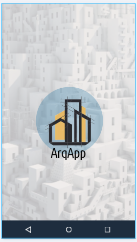
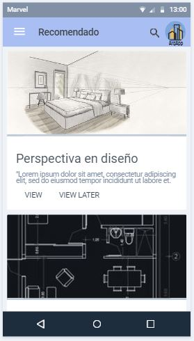
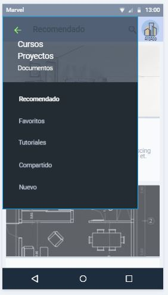
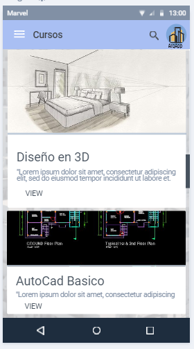
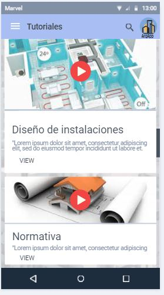

# Diseño de interfaz de usuario

La interfaz de usuario de la aplicación ArqApp en algunas interfaces de usuarios de aplicacionesMensionadas en las ideas de proyecto además haciendo uso de algunos conocimientos en diseño y herramientas de visualización.

El diseño completo se encuentra disponible en [Marvelapp](https://marvelapp.com/prototype/69gifd4).
Los colores a usar son basados en una combinación entre escala de grises y complementarios, tratando de resaltar de manera sutil el color azul. A continuación se presentan las principales pantallas: 

1.Inicio 
Cuando el usuario ingrese vera una lista de temas recomendados segun la información de busqueda anterior o relacionada.

Al seleccionar la listas desplegable de la vista recomendados se podra ver algunas de las actividades con las que el usuario podra interactuar, entre ellos los mas relevantes son los cursos, tutoriales y proyectos

2.Cursos
Al seleccionar cursos, el usuario verá una lista de los diferentes cursos que se encuentran disponibles además podra por medio de busqueda pordra investigas si se encuentra algun curso de su interes.

3.Tutoriales
En la vista tutoriales el usuario podra ver una lista de videos de interes y de busqueda para obtener información del tema a requerir.

